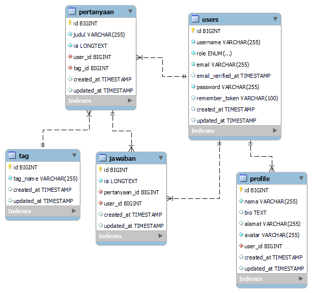

## Tentang Project Ini
Tanya.!n (Tanya.in) merupakan project untuk memenuhi tugas akhir yang diberikan oleh Kelompok 19. 
Anggota Kelompok:  
- Husnul Hayati (@husnulhayati)
- Putu Priyatna Pradipta (@priyana_Pradipta)
- Muhammad Naufal (@emnopal)
 

## Tentang Tanya.!n
Tanya.!n (Tanya.in) merupakan project fullstack web yang dibuat dengan menggunakan bahasa pemrograman PHP berbasis Framework Laravel.
Project ini merupakan project web tentang website tanya jawab

## Video Demo
[Demo Video Tanya.!n](https://youtu.be/7Por0ss2nyQ)

## Link Demo
[Demo Tanya.!n](https://tanyain.herokuapp.com/) 
Credentials Untuk Login:  

Role Admin:
Username: admin
Password: admin

Role User:
Username: user
Password: user

## Proses Development
Untuk Development dengan menggunakan Laravel:
- Clone repository ini
- `composer install`
- `php artisan migrate:fresh --seed`
- `php artisan serve`
 

Untuk Development dengan menggunakan Docker:
- Clone repository ini
- `composer install`
- `bash ./vendor/bin/sail up -d` (Untuk Linux dan Mac)
- `wsl -c ./vendor/bin/sail up -d` (Untuk Windows (Via WSL2))
- `./vendor/bin/sail artisan migrate:fresh --seed`

## ERD

